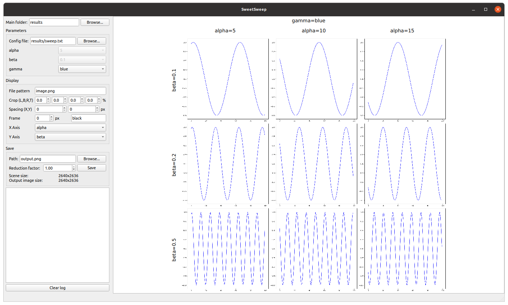

# SweetSweep
Small application to quickly visualize results from parameter sweeps.
Also comes with a script that does the sweep and saves the results in a format compatible with the viewer.



### Dependencies

For using the viewer, you will need those packages installed:
```bash
  pip install numpy PyQt5
```
For using the sweep example, you will need those:
```bash
  pip install matplotlib
```


### Quick start

You can use this app if the output folders of your parameter sweep are
named using their respective parameter values, like so:
```
$ ls results/
exp_00__alpha5_beta0.1_gammaRed/
exp_01__alpha5_beta0.1_gammaBlue/
exp_02__alpha5_beta0.2_gammaRed/
exp_03__alpha5_beta0.2_gammaBlue/
exp_04__alpha5_beta0.5_gammaRed/
exp_05__alpha5_beta0.5_gammaBlue/
exp_06__alpha10_beta0.1_gammaRed/
exp_07__alpha10_beta0.1_gammaBlue/
exp_08__alpha10_beta0.2_gammaRed/
exp_09__alpha10_beta0.2_gammaBlue/
exp_10__alpha10_beta0.5_gammaRed/
exp_11__alpha10_beta0.5_gammaBlue/
exp_12__alpha15_beta0.1_gammaRed/
exp_13__alpha15_beta0.1_gammaBlue/
exp_14__alpha15_beta0.2_gammaRed/
exp_15__alpha15_beta0.2_gammaBlue/
exp_16__alpha15_beta0.5_gammaRed/
exp_17__alpha15_beta0.5_gammaBlue/
sweep.txt
```

You just need to add a configuration file `sweep.txt` to your folder,
that describes each parameter and its values, in a JSON format:
```
$ cat results/sweep.txt
{
"alpha": [5, 10, 15],
"beta": [0.1, 0.2, 0.5],
"gamma": ["Red", "Blue"]
}
```
Let's say that each directory contains a file `image.png`,
and you want to compare the results in this file depending on the parameters.

This app allows you to:
- quickly visualize individual files, and easily switch between
parameter values
- visualize grids of the results with varying parameters in the X and Y axis
- save those visualizations to file

To run it, make sure you have installed the dependencies above, and simply run:
```bash
  python3 sweetsweep/viewer.py
```
The results folder can be passed as an argument so that you don't have to
enter it manually in the app.
```bash
  python3 sweetsweep/viewer.py <results>
```


### Sweep code and example

There is also a helper function in `sweep.py` that does the parameter sweep for you
and takes care of creating all the directories with the correct names, so that you
can directly use the viewer once the sweep is done.
There is an example on how to use it in `example.py`. To run it, simply do:
```bash
  python3 examples/example.py          # Runs the example parameter sweep
  python3 sweetsweep/viewer.py results/  # Launch the viewer to visualize the results
```


### Config file

- You can input the config file path manually, or if there is a `sweep.txt`
  file in the main folder, it will be loaded automatically.
- The parameter values don't have to be numerical, they can be anything as
  long as their `str()` representation is unique: `bool, int, str`, etc.
- You can also add meta parameters that are the viewer's parameters, and
  the application will load these values directly
  - `viewer_cropLBRT`: cropping images (LBRT: Left,Bottom,Right,Top).

    e.g.: `"viewer_cropLBRT": [35,40,30,15],`
  - `viewer_filePattern`: text for the file pattern textbox. You can also pass
  a list of filenames or file patterns, and it will create a combo box containing
  this list so that you can quickly switch between them.

    e.g.: `"viewer_filePattern": "image.png",`
    or: `"viewer_filePattern": ["image1.png","image2.png"],`


### Miscellaneous

- You can zoom in the view with the mouse wheel, and move around with
  `Left-click + drag.`
- The file pattern supports glob patterns (using the `*` wildcard), along with
  an index selector: `image_*.png[<idx>]`. You can replace `<idx>` with a number
  that selects which match to plot. Negative indices count from the end, so
  `image_*.png[-1]` selects the last file that matches `image_*.png` in the
  folder. The matched files are in alphanumerical order. The matched pattern
  (what `*` replaces) is drawn in the top left corner of each image. This is
  useful if you have an iterative algorithm, and you want to plot the result
  of the last iteration of each folder.
- The app can access mounted folders, which is great if you ran the sweep on
  a server, because you don't to copy all result folders to your computer.
  I only tried on Linux with a folder mounted with `sftp`, in which case the
  URL you need to provide is:
  `/run/user/$uid/gvfs/sftp:host=<host>,user=<user>/path/to/folder`.
  Replace `<host>` by the host name, `<user>` by your username, `$uid` by
  your user id, which you can get by running `id -u` (it is `1000` if you are the
  only user on your system), and `path/to/folder` by the path to the remote folder.
